# การวิเคราะห์ความเหมาะสม PLOs และ CLOs
## รายวิชา FDTX1201 การสร้างสรรค์สิ่งทอและเครื่องนุ่งห่มในวิถีชีวิตสมัยใหม่

---

## 🟢 **จุดแข็ง (Strengths)**

### 1. **ความสอดคล้องระหว่าง PLOs กับ CLOs**
- **เชื่อมโยงชัดเจน**: CLOs ครอบคลุม PLOs ทั้ง 4 ด้านอย่างสมดุล
- **ลำดับขั้นที่เหมาะสม**: เริ่มจากความรู้พื้นฐาน → ทักษะ → จริยธรรม → ลักษณะบุคคล
- **การกระจายสัดส่วน**: ด้านความรู้ (30%), ทักษะ (50%), จริยธรรม+บุคลิกภาพ (20%)

### 2. **ความครอบคลุมของเนื้อหา**
- **ครอบคลุมห่วงโซ่ผลิต**: จากวัตถุดิบ → การออกแบบ → การผลิต → การตลาด
- **บูรณาการ 3 มิติ**: สิ่งแวดล้อม เศรษฐกิจ สังคม (CLO 7)
- **เน้นความยั่งยืน**: สอดคล้องกับเทรนด์โลก ESG

### 3. **การเชื่อมโยงกับโลกแห่งความจริง**
- **ตอบสนองตลาดแรงงาน**: ทักษะที่ใช้งานได้จริงในอุตสาหกรรม
- **เทคโนโลยีสมัยใหม่**: Adobe Illustrator, Canva
- **ผลงานขายได้**: สามารถสร้างรายได้ระหว่างเรียน

---

## 🟡 **จุดที่ควรปรับปรุง (Areas for Improvement)**

### 1. **ความทับซ้อนของ CLOs**
**ปัญหา**: CLO 9 และ CLO 10 มีเนื้อหาซ้ำกัน
- CLO 9: "ปฏิบัติตนตามบทบาท หน้าที่... ทำงานร่วมกับผู้อื่นได้"
- CLO 10: "ปฏิบัติตนตามบทบาท หน้าที่... ทำงานร่วมกับผู้อื่นได้"

**คำแนะนำ**: รวม CLO 9-10 เป็นข้อเดียว หรือแยกให้ชัดเจน เช่น:
- CLO 9: เน้นจริยธรรมส่วนบุคคล
- CLO 10: เน้นทักษะการทำงานเป็นทีม

### 2. **การวัดผลที่ไม่ชัดเจน**
**ปัญหา**: 
- CLO 1 ใช้คำว่า "อธิบายได้อย่างถูกต้อง" แต่ไม่ระบุเกณฑ์ "ถูกต้อง"
- การประเมิน CLO 9-10 พึ่งพา "การสังเกตพฤติกรรม" ซึ่งอาจมีความเอนเอียง

**คำแนะนำ**: สร้าง Rubric ที่ชัดเจนสำหรับการประเมิน

### 3. **ระดับความยาก (Bloom's Taxonomy)**
**ปัญหา**: CLOs ส่วนใหญ่อยู่ในระดับต่ำ
- CLO 1-3: จำ/เข้าใจ (Remember/Understand)
- CLO 4-8: ประยุกต์/วิเคราะห์ (Apply/Analyze)
- ขาดระดับ Evaluate/Create

**คำแนะนำ**: เพิ่ม CLO ระดับสูง เช่น "ประเมินผลกระทบสิ่งแวดล้อม" หรือ "สร้างนวัตกรรมสิ่งทอใหม่"

---

## 🔴 **จุดอ่อนสำคัญ (Critical Weaknesses)**

### 1. **ขาดมิติเทคโนโลยีอนาคต**
**ปัญหา**: ไม่มี CLO เกี่ยวกับ:
- AI/Machine Learning ในการออกแบบ
- 3D Printing สิ่งทอ
- Smart Textiles/Wearable Technology
- Metaverse Fashion

### 2. **ขาดทักษะดิจิทัลขั้นสูง**
**ปัญหา**: เครื่องมือที่ระบุยังไม่ครอบคลุม:
- CAD software เฉพาะทาง (CLO 3D, Browzwear)
- การวิเคราะห์ข้อมูลผู้บริโภค
- E-commerce และ Digital Marketing

### 3. **ขาดมิติ Entrepreneurship**
**ปัญหา**: แม้จะกล่าวถึงการสร้างรายได้ แต่ไม่มี CLO เฉพาะเรื่อง:
- การตั้งธุรกิจ Start-up
- การจัดการห่วงโซ่อุปทาน
- การวิเคราะห์ตลาด

---

## 📊 **คะแนนการประเมิน**

| ด้าน | คะแนน | หมายเหตุ |
|------|-------|-----------|
| ความสอดคล้อง PLOs-CLOs | 8/10 | ดีมาก แต่มีการทับซ้อน |
| ความครอบคลุมเนื้อหา | 7/10 | ดี แต่ขาดเทคโนโลยีใหม่ |
| ความเป็นไปได้ในการประเมิน | 6/10 | ปานกลาง ขาด Rubric ชัดเจน |
| ความทันสมัย | 6/10 | ปานกลาง ยังติดอยู่กับเครื่องมือเก่า |
| การเชื่อมโยงอาชีพ | 8/10 | ดีมาก มีการเน้นการใช้งานจริง |

**คะแนนรวม: 7/10** ⭐⭐⭐⭐⭐⭐⭐☆☆☆

---

## 🎯 **ข้อเสนอแนะการปรับปรุง**

### 1. **เร่งด่วน (Immediate)**
- รวม CLO 9-10 หรือแยกให้ชัดเจน
- สร้าง Rubric การประเมินผลสำหรับทุก CLO
- เพิ่มเครื่องมือดิจิทัลใหม่ๆ

### 2. **ระยะกลาง (Medium-term)**
- เพิ่ม CLO เกี่ยวกับเทคโนโลยีอนาคต
- บูรณาการ Entrepreneurship Skills
- พัฒนา Project-based Learning

### 3. **ระยะยาว (Long-term)**
- ความร่วมมืออุตสาหกรรม (Industry Partnership)
- การแลกเปลี่ยนนานาชาติ
- การวิจัยและพัฒนานวัตกรรม

---

---

## 📋 **Rubric การประเมินผลสำหรับทุก CLO**

### **CLO 1: ความรู้เบื้องต้นเกี่ยวกับการสร้างสรรค์สิ่งทอและเครื่องนุ่งห่ม**

| ระดับ | คะแนน | เกณฑ์การประเมิน |
|-------|-------|------------------|
| **ดีเยี่ยม** | 4 | อธิบายได้ครบถ้วน ชัดเจน มีตัวอย่างประกอบ เชื่อมโยงกับบริบทปัจจุบันได้ |
| **ดี** | 3 | อธิบายได้ถูกต้อง ชัดเจน มีตัวอย่างประกอบบ้าง |
| **พอใช้** | 2 | อธิบายได้พื้นฐาน มีความถูกต้องบางส่วน |
| **ต้องปรับปรุง** | 1 | อธิบายได้ไม่ชัดเจน หรือมีข้อผิดพลาดมาก |

### **CLO 2: การจำแนกประเภทของสิ่งทอและเครื่องนุ่งห่ม**

| ระดับ | คะแนน | เกณฑ์การประเมิน |
|-------|-------|------------------|
| **ดีเยี่ยม** | 4 | จำแนกได้ครบทุกประเภท ระบุคุณสมบัติและการใช้งานได้ชัดเจน |
| **ดี** | 3 | จำแนกได้ถูกต้อง 80-90% ระบุคุณสมบัติหลักได้ |
| **พอใช้** | 2 | จำแนกได้ถูกต้อง 60-79% มีความเข้าใจพื้นฐาน |
| **ต้องปรับปรุง** | 1 | จำแนกได้น้อยกว่า 60% หรือมีข้อผิดพลาดมาก |

### **CLO 3: วัสดุและอุปกรณ์ในการสร้างสรรค์สิ่งทอ**

| ระดับ | คะแนน | เกณฑ์การประเมิน |
|-------|-------|------------------|
| **ดีเยี่ยม** | 4 | ระบุวัสดุ-อุปกรณ์ได้ครบ นำไปใช้งานได้อย่างมีประสิทธิภาพ |
| **ดี** | 3 | ระบุได้ถูกต้อง ใช้งานได้ดี มีความปลอดภัย |
| **พอใช้** | 2 | ระบุได้พื้นฐาน ใช้งานได้แต่ไม่คล่องแคล่ว |
| **ต้องปรับปรุง** | 1 | ระบุได้น้อย ใช้งานไม่ถูกต้องหรือไม่ปลอดภัย |

### **CLO 4: การวิเคราะห์แรงบันดาลใจและถ่ายทอดเป็นแนวคิดออกแบบ**

| ระดับ | คะแนน | เกณฑ์การประเมิน |
|-------|-------|------------------|
| **ดีเยี่ยม** | 4 | วิเคราะห์ลึกซึ้ง แนวคิดออกแบบต้นฉบับ เป็นระบบ น่าสนใจ |
| **ดี** | 3 | วิเคราะห์ได้ดี แนวคิดชัดเจน มีเหตุผลรองรับ |
| **พอใช้** | 2 | วิเคราะห์ได้ในระดับพื้นฐาน แนวคิดเข้าใจได้ |
| **ต้องปรับปรุง** | 1 | วิเคราะห์ผิวเผิน แนวคิดไม่ชัดเจนหรือไม่เชื่อมโยง |

### **CLO 5: การวิเคราะห์แนวโน้มการผลิตสิ่งทอในอนาคต**

| ระดับ | คะแนน | เกณฑ์การประเมิน |
|-------|-------|------------------|
| **ดีเยี่ยม** | 4 | วิเคราะห์แนวโน้มแม่นยำ เสนอแนวทางนวัตกรรม เชื่อมโยงบริบทโลก |
| **ดี** | 3 | วิเคราะห์แนวโน้มได้ดี เสนอแนวทางเหมาะสม |
| **พอใช้** | 2 | วิเคราะห์ได้พื้นฐาน เสนอแนวทางทั่วไป |
| **ต้องปรับปรุง** | 1 | วิเคราะห์ไม่ถูกต้อง หรือไม่สามารถเสนอแนวทางได้ |

### **CLO 6: ความเชื่อมโยงระหว่างเทรนด์ไลฟ์สไตล์กับการสร้างสรรค์สิ่งทอ**

| ระดับ | คะแนน | เกณฑ์การประเมิน |
|-------|-------|------------------|
| **ดีเยี่ยม** | 4 | อธิบายความเชื่อมโยงซับซ้อน มีการวิเคราะห์เชิงลึก ยกตัวอย่างหลากหลาย |
| **ดี** | 3 | อธิบายความเชื่อมโยงได้ชัดเจน มีตัวอย่างเหมาะสม |
| **พอใช้** | 2 | อธิบายได้ในระดับพื้นฐาน เข้าใจความเชื่อมโยงหลัก |
| **ต้องปรับปรุง** | 1 | อธิบายไม่ชัดเจน หรือไม่เห็นความเชื่อมโยง |

### **CLO 7: การออกแบบการสร้างสรรค์สิ่งทออย่างยั่งยืน**

| ระดับ | คะแนน | เกณฑ์การประเมิน |
|-------|-------|------------------|
| **ดีเยี่ยม** | 4 | ออกแบบครบ 3 มิติ (สิ่งแวดล้อม เศรษฐกิจ สังคม) มีนวัตกรรม ใช้ทรัพยากรอย่างชาญฉลาด |
| **ดี** | 3 | ออกแบบคำนึงถึงความยั่งยืน ใช้ทรัพยากรมีประสิทธิภาพ |
| **พอใช้** | 2 | มีแนวคิดความยั่งยืนพื้นฐาน ใช้ทรัพยากรระวัง |
| **ต้องปรับปรุง** | 1 | ไม่คำนึงถึงความยั่งยืน หรือใช้ทรัพยากรไม่เหมาะสม |

### **CLO 8: ทักษะการปฏิบัติงานการสร้างสรรค์สิ่งทอและเครื่องนุ่งห่ม**

| ระดับ | คะแนน | เกณฑ์การประเมิน |
|-------|-------|------------------|
| **ดีเยี่ยม** | 4 | ผลงานมีคุณภาพสูง ตอบโจทย์ผู้บริโภค มีเอกลักษณ์ สามารถต่อยอดเชิงพาณิชย์ |
| **ดี** | 3 | ผลงานมีคุณภาพดี ตอบโจทย์ผู้บริโภค มีความคิดสร้างสรรค์ |
| **พอใช้** | 2 | ผลงานผ่านเกณฑ์ ตอบโจทย์พื้นฐาน |
| **ต้องปรับปรุง** | 1 | ผลงานไม่ผ่านเกณฑ์ หรือไม่ตอบโจทย์ผู้บริโภค |

### **CLO 9: ความซื่อสัตย์และความรับผิดชอบ**

| ระดับ | คะแนน | เกณฑ์การประเมิน |
|-------|-------|------------------|
| **ดีเยี่ยม** | 4 | แสดงความซื่อสัตย์สูง รับผิดชอบงานเกินคาดหวัง เป็นแบบอย่างที่ดี |
| **ดี** | 3 | ซื่อสัตย์ รับผิดชอบงานดี ส่งงานตรงเวลา มีคุณภาพ |
| **พอใช้** | 2 | ซื่อสัตย์ รับผิดชอบงานพื้นฐาน ส่งงานตรงเวลา |
| **ต้องปรับปรุง** | 1 | ขาดความซื่อสัตย์ หรือไม่รับผิดชอบงาน ส่งงานช้า |

### **CLO 10: การทำงานร่วมกับผู้อื่น**

| ระดับ | คะแนน | เกณฑ์การประเมิน |
|-------|-------|------------------|
| **ดีเยี่ยม** | 4 | ทำงานทีมได้ยอดเยี่ยม มีภาวะผู้นำ ช่วยเหลือสมาชิก แก้ปัญหาได้ดี |
| **ดี** | 3 | ทำงานทีมได้ดี ร่วมมือดี มีส่วนร่วมในการแก้ปัญหา |
| **พอใช้** | 2 | ทำงานทีมได้ ปฏิบัติตามบทบาทหน้าที่ |
| **ต้องปรับปรุง** | 1 | ทำงานทีมได้ยาก ไม่ร่วมมือ หรือสร้างปัญหาในทีม |

---

## 🎯 **วิธีการใช้ Rubric**

### **สำหรับอาจารย์:**
1. **ใช้ Rubric ประเมินงานแต่ละชิ้น** ให้คะแนนตามเกณฑ์
2. **ให้ Feedback เฉพาะจุด** ตามระดับที่นักศึกษาได้
3. **ระบุจุดที่ต้องพัฒนา** เพื่อยกระดับขึ้นไป

### **สำหรับนักศึกษา:**
1. **ศึกษา Rubric ก่อนทำงาน** เพื่อเข้าใจเป้าหมาย
2. **ประเมินตนเองตาม Rubric** ก่อนส่งงาน
3. **ใช้เป็นเครื่องมือพัฒนาตนเอง** อย่างต่อเนื่อง

### **การคำนวณคะแนน:**
- **ระดับดีเยี่ยม (4)** = A (80%+)
- **ระดับดี (3)** = B+/B (70-79%)
- **ระดับพอใช้ (2)** = C+/C (60-69%)
- **ระดับต้องปรับปรุง (1)** = D/F (<60%)

---

## 📁 **เอกสารหลักฐานและเครื่องมือประเมิน**

### **CLO 1-3: ด้านความรู้**

| CLO | เอกสารหลักฐาน | เวลาประเมิน | เกณฑ์ให้คะแนน | กระบวนการประเมิน |
|-----|----------------|--------------|----------------|-------------------|
| **CLO 1** | • คำตอบข้อสอบกลางภาค/ปลายภาค<br>• รายงานการค้นคว้า<br>• การตอบคำถามท้ายบทเรียน | • สัปดาห์ที่ 7 (กลางภาค)<br>• สัปดาห์ที่ 17 (ปลายภาค)<br>• ทุกสัปดาห์ (คำถามท้ายบท) | **35% รวม:**<br>• ข้อสอบกลางภาค 15%<br>• ข้อสอบปลายภาค 15%<br>• คำถามท้ายบท 2%<br>• การค้นคว้า 3% | 1. ตรวจข้อสอบด้วย Rubric<br>2. ประเมินรายงานตามเกณฑ์<br>3. ให้ Feedback ทันที |
| **CLO 2** | • การทำงานกลุ่มจำแนกประเภทสิ่งทอ<br>• รายงานการศึกษาค้นคว้า<br>• การนำเสนอหน้าชั้น | • สัปดาห์ที่ 2-3<br>• สัปดาห์ที่ 4 (นำเสนอ) | **5% รวม:**<br>• คำถามท้ายบท 2%<br>• การค้นคว้า 3% | 1. ประเมินการทำงานกลุ่ม<br>2. ให้คะแนนการนำเสนอ<br>3. Peer Assessment |
| **CLO 3** | • ใบงานการใช้วัสดุ-อุปกรณ์<br>• รายงานการศึกษาวัสดุ<br>• การสาธิตการใช้งาน | • สัปดาห์ที่ 3-4<br>• สัปดาห์ที่ 5 (สาธิต) | **5% รวม:**<br>• คำถามท้ายบท 2%<br>• การค้นคว้า 3% | 1. ประเมินการใช้อุปกรณ์จริง<br>2. ตรวจสอบความปลอดภัย<br>3. ประเมินรายงาน |

### **CLO 4-8: ด้านทักษะ**

| CLO | เอกสารหลักฐาน | เวลาประเมิน | เกณฑ์ให้คะแนน | กระบวนการประเมิน |
|-----|----------------|--------------|----------------|-------------------|
| **CLO 4** | • Mood Board แรงบันดาลใจ<br>• Design Brief<br>• Sketch/Design ต้นฉบับ<br>• การนำเสนอแนวคิด | • สัปดาห์ที่ 5-6<br>• สัปดาห์ที่ 7 (นำเสนอ) | **10% รวม:**<br>• คำถามท้ายบท 2%<br>• ผลงานปฏิบัติ 5%<br>• การนำเสนอ 3% | 1. ประเมินความคิดสร้างสรรค์<br>2. วิเคราะห์กระบวนการคิด<br>3. ประเมินการถ่ายทอดแนวคิด |
| **CLO 5** | • รายงานแนวโน้มอนาคต<br>• การวิเคราะห์ Trend<br>• ข้อเสนอนวัตกรรม<br>• การนำเสนอ | • สัปดาห์ที่ 8-9<br>• สัปดาห์ที่ 10 (นำเสนอ) | **10% รวม:**<br>• คำถามท้ายบท 2%<br>• ผลงานปฏิบัติ 5%<br>• การนำเสนอ 3% | 1. ประเมินการวิจัยข้อมูล<br>2. วิเคราะห์ความคิดเชิงกลยุทธ์<br>3. ประเมินความเป็นไปได้ |
| **CLO 6** | • รายงานเทรนด์ไลฟ์สไตล์<br>• ผลงานสิ่งทอที่เชื่อมโยง<br>• รูปเล่มรายงาน | • สัปดาห์ที่ 10-11<br>• สัปดาห์ที่ 12 (ส่งงาน) | **10% รวม:**<br>• คำถามท้ายบท 2%<br>• ผลงานปฏิบัติ 5%<br>• รูปเล่มรายงาน 3% | 1. ประเมินการเชื่อมโยงแนวคิด<br>2. วิเคราะห์ความเข้าใจตลาด<br>3. ประเมินคุณภาพรายงาน |
| **CLO 7** | • ผลงานสิ่งทอยั่งยืน<br>• รายงาน LCA Assessment<br>• รูปเล่มรายงาน | • สัปดาห์ที่ 12-13<br>• สัปดาห์ที่ 14 (ส่งงาน) | **10% รวม:**<br>• คำถามท้ายบท 2%<br>• ผลงานปฏิบัติ 5%<br>• รูปเล่มรายงาน 3% | 1. ประเมินแนวคิดยั่งยืน<br>2. วิเคราะห์ผลกระทบสิ่งแวดล้อม<br>3. ประเมินนวัตกรรม |
| **CLO 8** | • ผลงานคอลเลคชัน<br>• Portfolio ผลงาน<br>• การนำเสนอสาธารณะ<br>• การประเมินจากผู้เชี่ยวชาญ | • สัปดาห์ที่ 14-16<br>• สัปดาห์ที่ 16 (นำเสนอ) | **10% รวม:**<br>• คำถามท้ายบท 2%<br>• ผลงานปฏิบัติ 5%<br>• การนำเสนอ 3% | 1. ประเมินคุณภาพผลงาน<br>2. วิเคราะห์ตอบโจทย์ผู้บริโภค<br>3. ประเมินศักยภาพเชิงพาณิชย์ |

### **CLO 9-10: ด้านจริยธรรมและลักษณะบุคคล**

| CLO | เอกสารหลักฐาน | เวลาประเมิน | เกณฑ์ให้คะแนน | กระบวนการประเมิน |
|-----|----------------|--------------|----------------|-------------------|
| **CLO 9** | • แบบสังเกตพฤติกรรมรายสัปดาห์<br>• การประเมินตนเอง<br>• Peer Assessment<br>• บันทึกการมาเรียน | • ทุกสัปดาห์ตลอดภาค<br>• สัปดาห์ที่ 8 (กลางภาค)<br>• สัปดาห์ที่ 16 (สรุปผล) | **2.5%**<br>• การสังเกตพฤติกรรม 2.5% | 1. สังเกตพฤติกรรมต่อเนื่อง<br>2. บันทึกรายสัปดาห์<br>3. ประเมินรวมท้ายภาค |
| **CLO 10** | • แบบประเมินการทำงานทีม<br>• โครงการกลุ่ม<br>• การแก้ปัญหาเฉพาะหน้า<br>• ผลงานร่วมกัน | • ทุกครั้งที่มีงานกลุ่ม<br>• สัปดาห์ที่ 16 (สรุปผล) | **2.5%**<br>• การสังเกตพฤติกรรม 2.5% | 1. ประเมินในงานกลุ่มจริง<br>2. Peer Assessment<br>3. สังเกตภาวะผู้นำ |

---

## 📊 **ระบบการประเมินแบบองค์รวม (Holistic Assessment)**

### **1. เครื่องมือประเมิน Multi-dimensional**

```
คะแนนรวม CLO = Σ (คะแนน Rubric × น้ำหนัก × จำนวนครั้งประเมิน)
```

### **2. Timeline การประเมิน**

| สัปดาห์ | กิจกรรมประเมิน | CLO ที่เกี่ยวข้อง | % น้ำหนัก |
|---------|----------------|-----------------|----------|
| 1-2 | Baseline Assessment | CLO 1, 9, 10 | 5% |
| 3-4 | การใช้วัสดุ-อุปกรณ์ | CLO 2, 3 | 10% |
| 5-6 | การออกแบบเบื้องต้น | CLO 4 | 10% |
| 7 | **สอบกลางภาค** | CLO 1-3 | 15% |
| 8-9 | วิเคราะห์แนวโน้ม | CLO 5 | 10% |
| 10-11 | เทรนด์และไลฟ์สไตล์ | CLO 6 | 10% |
| 12-13 | การออกแบบยั่งยืน | CLO 7 | 10% |
| 14-16 | Project สุดท้าย | CLO 8 | 15% |
| 17 | **สอบปลายภาค** | All CLOs | 15% |

### **3. Quality Assurance Process**

```mermaid
graph TD
    A[การประเมิน] --> B[Double Marking]
    B --> C[External Moderation]
    C --> D[Feedback Session]
    D --> E[Improvement Plan]
    E --> F[Next Cycle]
```



---

## 🎯 **ประเมินภาพรวมคะแนนและคุณภาพ**

### **การวิเคราะห์คะแนนรวม:**

| หมวด | น้ำหนักรวม | คะแนนเฉลี่ยคาดการณ์ | ระดับคุณภาพ |
|------|------------|---------------------|-------------|
| **ความรู้** (CLO 1-3) | 45% | 75% | ดี |
| **ทักษะ** (CLO 4-8) | 50% | 72% | ดี |
| **จริยธรรม/บุคลิกภาพ** (CLO 9-10) | 5% | 85% | ดีเยี่ยม |
| **คะแนนรวมทั้งหมด** | 100% | 74% | **B+ / ดี** |

### **จุดแข็งของระบบประเมิน:**

✅ **ครอบคลุมทุกมิติ**: ความรู้ ทักษะ จริยธรรม บุคลิกภาพ  
✅ **ประเมินต่อเนื่อง**: ไม่พึ่งสอบครั้งเดียว  
✅ **หลักฐานหลากหลาย**: เอกสาร ผลงาน การสังเกต  
✅ **Rubric ชัดเจน**: เกณฑ์เดียวกันทุกคน  
✅ **Authentic Assessment**: ประเมินในสถานการณ์จริง  

### **จุดที่ต้องปรับปรุง:**

⚠️ **การกระจายน้ำหนัก**: ความรู้ถ่วงน้ำหนักมากเกินไป (45%)  
⚠️ **ทักษะดิจิทัล**: ยังขาดการประเมินเครื่องมือใหม่  
⚠️ **การประเมินโดยภายนอก**: ควรมีผู้เชี่ยวชาญจากอุตสาหกรรม  
⚠️ **Self-Assessment**: ควรเพิ่มการประเมินตนเองมากขึ้น  

### **คะแนนคุณภาพโดยรวม: 8.2/10** ⭐⭐⭐⭐⭐⭐⭐⭐☆☆

---

## 🚨 **การแก้ไขปัญหา CLO 9-10 ที่ซ้ำกัน (เร่งด่วน)**

### **📋 ปัญหาปัจจุบัน:**

**CLO 9 (เดิม):** "ผู้เรียนแสดงออกซึ่งความซื่อสัตย์ ความรับผิดของต่องานที่ได้รับมอบหมาย และ**ปฏิบัติตนตามบทบาท หน้าที่ได้อย่างเหมาะสม และสามารถทำงานร่วมกับผู้อื่นได้**"

**CLO 10 (เดิม):** "ผู้เรียน**ปฏิบัติตนตามบทบาท หน้าที่ได้อย่างเหมาะสม และสามารถทำงานร่วมกับผู้อื่นได้**"

🔴 **ความซ้ำกัน 80%** - ข้อความเกือบเหมือนกันทั้งคู่!

---

## 🎯 **ตัวเลือกการแก้ไข**

### **ตัวเลือก A: รวมเป็น CLO เดียว (แนะนำ)**

**CLO 9 ใหม่:** "ผู้เรียนแสดงออกซึ่งความซื่อสัตย์ ความรับผิดชอบต่องานที่ได้รับมอบหมาย สามารถปฏิบัติตนตามบทบาทหน้าที่ และทำงานร่วมกับผู้อื่นได้อย่างมีประสิทธิภาพ"

**ลบ CLO 10** และปรับน้ำหนักการประเมิน

**ข้อดี:**
- ✅ กะทัดรัด ไม่ซ้ำซ้อน
- ✅ ครอบคลุมทั้งจริยธรรมและลักษณะบุคคล
- ✅ ลดภาระการประเมิน
- ✅ มี CLO รวม 9 ข้อ (จำนวนเหมาะสม)

**ข้อเสีย:**
- ❌ อาจครอบคลุมหลายด้านมากเกินไป
- ❌ ยากต่อการประเมินเฉพาะจุด

---

### **ตัวเลือก B: แยกให้ชัดเจน (ทางเลือก)**

**CLO 9 ปรับใหม่:** "ผู้เรียนแสดงออกซึ่งความซื่อสัตย์ ความรับผิดชอบ วินัยในตนเอง และจริยธรรมทางวิชาชีพในการปฏิบัติงาน"

**CLO 10 ปรับใหม่:** "ผู้เรียนมีทักษะการทำงานเป็นทีม สื่อสารอย่างมีประสิทธิภาพ มีภาวะผู้นำ และแก้ไขปัญหาร่วมกันได้"

**ข้อดี:**
- ✅ แยกประเด็นชัดเจน (จริยธรรม vs ทักษะสังคม)
- ✅ ประเมินได้เฉพาะเจาะจง
- ✅ สอดคล้องกับกรอบ TQF (แยกจริยธรรม/ลักษณะบุคคล)

**ข้อเสีย:**
- ❌ เพิ่มจำนวน CLO (รวม 10 ข้อ)
- ❌ เพิ่มภาระการประเมิน

---

## 📊 **เปรียบเทียบตัวเลือก**

| หัวข้อ | ตัวเลือก A (รวม) | ตัวเลือก B (แยก) |
|--------|-------------------|-------------------|
| **ความชัดเจน** | 7/10 | 9/10 |
| **ภาระการประเมิน** | 9/10 | 6/10 |
| **ความครอบคลุม** | 8/10 | 9/10 |
| **ความเป็นปฏิบัติได้** | 9/10 | 7/10 |
| **สอดคล้อง TQF** | 7/10 | 10/10 |
| **คะแนนรวม** | **40/50** | **41/50** |

---

## 🏆 **คำแนะนำขั้นสุดท้าย: ตัวเลือก B+ (แยกแบบปรับปรุง)**

### **CLO 9 (จริยธรรมทางวิชาชีพ):**
**"ผู้เรียนปฏิบัติตามหลักจริยธรรมทางวิชาชีพ แสดงความซื่อสัตย์ ความรับผิดชอบ วินัยในตนเอง และใช้ทรัพยากรอย่างประหยัดและเหมาะสม"**

**การประเมิน CLO 9:**
- สังเกตพฤติกรรมการใช้วัสดุ (ไม่สิ้นเปลือง)
- ความซื่อสัตย์ในการทำงาน (ไม่ลอกงาน)
- การส่งงานตรงเวลา และมีคุณภาพ
- การเข้าเรียนสม่ำเสมอ

### **CLO 10 (ทักษะการทำงานร่วมกัน):**
**"ผู้เรียนมีทักษะการทำงานเป็นทีม สื่อสารอย่างมีประสิทธิภาพ แสดงภาวะผู้นำเมื่อเหมาะสม และร่วมกันแก้ไขปัญหาได้อย่างสร้างสรรค์"**

**การประเมิน CLO 10:**
- ประเมินผลงานกลุ่ม (ทุกคนมีส่วนร่วม)
- สังเกตการสื่อสารในชั้นเรียน
- ภาวะผู้นำในการนำเสนอ
- การแก้ไขปัญหาเฉพาะหน้าร่วมกัน

---

## 📋 **การปรับปรุงระบบการประเมิน CLO 9-10**

### **น้ำหนักการประเมินใหม่:**

| CLO | เดิม | ใหม่ | รายละเอียด |
|-----|------|------|-------------|
| **CLO 9** | 2.5% | **3%** | • การสังเกตพฤติกรรม 1.5%<br>• แบบประเมินตนเอง 0.5%<br>• การรายงานการใช้ทรัพยากร 1% |
| **CLO 10** | 2.5% | **2%** | • การประเมินงานกลุ่ม 1%<br>• Peer Assessment 0.5%<br>• การสังเกตภาวะผู้นำ 0.5% |

### **เครื่องมือประเมินเพิ่มเติม:**

#### **CLO 9: แบบฟอร์มสังเกตจริยธรรม**
```
□ เข้าเรียนตรงเวลาสม่ำเสมอ
□ ใช้วัสดุอย่างประหยัด ไม่สิ้นเปลือง
□ ไม่ลอกผลงานผู้อื่น อ้างอิงแหล่งที่มาชัดเจน
□ รับผิดชอบงานที่ได้รับมอบหมาย
□ แต่งกายเหมาะสมกับการปฏิบัติงาน
```

#### **CLO 10: แบบประเมินทักษะทีมเวิร์ก**
```
□ มีส่วนร่วมในการอภิปรายกลุ่ม
□ รับฟังความคิดเห็นผู้อื่นด้วยใจเปิด
□ แสดงความคิดเห็นอย่างสร้างสรรค์
□ ช่วยเหลือสมาชิกกลุ่มเมื่อจำเป็น
□ แก้ไขปัญหาร่วมกันอย่างสันติ
```

---

## ✅ **ขั้นตอนการดำเนินการ**

### **ระยะเวลา: 2 สัปดาห์**

1. **สัปดาห์ที่ 1:** ปรับคำศัพท์ CLO 9-10 ในเอกสาร OBE3
2. **สัปดาห์ที่ 2:** สร้างแบบฟอร์มประเมินและ Rubric ใหม่
3. **ก่อนเปิดเทอม:** อบรมอาจารย์ผู้สอนเรื่องการประเมินแบบใหม่
4. **สัปดาห์ที่ 1 ของภาคเรียน:** แจ้งเกณฑ์การประเมินใหม่ให้นักศึกษา

### **ผู้รับผิดชอบ:**
- อาจารย์ประจำรายวิชา
- คณะกรรมการบริหารหลักสูตร
- งานวิชาการของมหาวิทยาลัย

**สรุป**: ระบบประเมินมีคุณภาพดี มีโครงสร้างชัดเจน แต่ยังต้องปรับให้ทันสมัยและเน้นทักษะปฏิบัติมากขึ้น

---

## ✅ **สรุป**

รายวิชานี้มี **รากฐานที่แข็งแกร่ง** ในการเชื่อมโยง PLOs กับ CLOs แต่ยัง**ขาดการปรับตัวสู่ยุคดิจิทัล** อย่างเต็มที่ การเพิ่ม **Rubric การประเมินผล** จะช่วยให้การเรียนการสอน**มีมาตรฐานชัดเจน**และ**พัฒนานักศึกษาได้อย่างเป็นระบบ** การปรับปรุงอื่นๆ ที่แนะนำจะช่วยให้รายวิชานี้**ก้าวทันโลก**และ**เตรียมนักศึกษาสู่อนาคต**ได้ดียิ่งขึ้น
